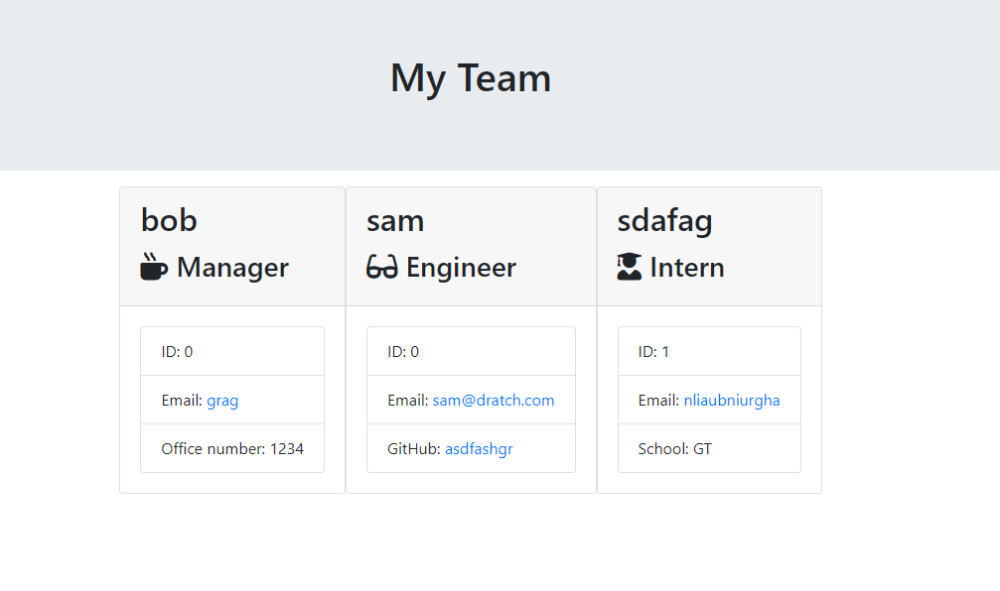

# HW10-Team-Profile
## Description
This program is designed to generate a html file that displays a teams information.
The Teams are generated through user input.
The team contains atleast a manager and any number of engineer and interns
Once the entire team is created then an html file is made called "team.html" in the output folder

## Example

